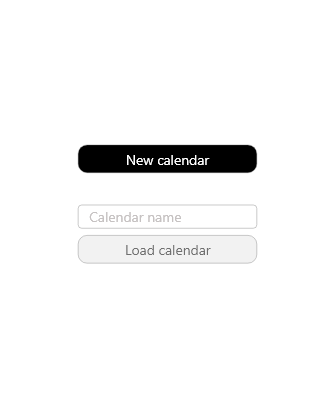
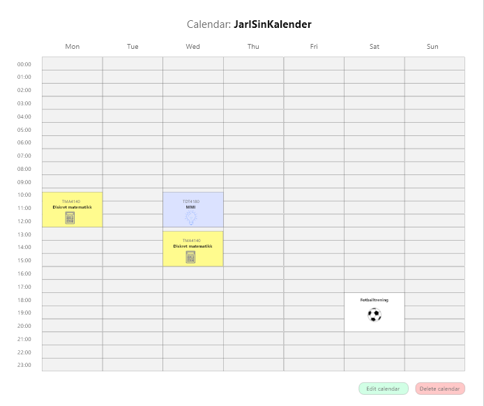

#### Description of the app

The app will consist of a personal timetable for a fixed weekly basis. Here, a user should be able to create a schedule and fill it with content from predetermined plans, such as regular yoga classes with a gym, or self-determined plans, such as weekly meetings with the family. The app must then show the timetable in a clear manner using a table-based graphic display.

Users can simply create a timetable with a unique calendar name in the app, and this is then saved on the server. Thus, users can easily retrieve their timetable on other devices using the unique calendar name under which the timetable was generated. The user can change the content of his or her timetable at any given time.

The timetable is not initially intended as a calendar with events that change for each week during the year. The area of ​​use is mainly aimed at fixed plans that are repeated every week over a certain period of time, for example over a summer, a semester or a year.

**Sample images to make it easier to visualize the functionality of the finished application**:

