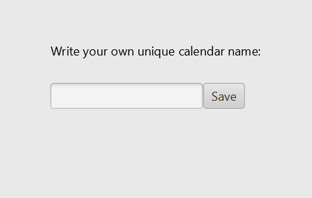

#### Description of the app

The app will consist of a personal timetable for a fixed weekly basis. Here, a user should be able to create a schedule and fill it with content from predetermined plans, such as regular yoga classes with a gym, or self-determined plans, such as weekly meetings with the family. The app must then show the timetable in a clear manner using a table-based graphic display.

Users can simply create a timetable with a unique calendar name in the app, and this is then saved on the server. Thus, users can easily retrieve their timetable on other devices using the unique calendar name under which the timetable was generated. The user can change the content of his or her timetable at any given time.

The timetable is not initially intended as a calendar with events that change for each week during the year. The area of ​​use is mainly aimed at fixed plans that are repeated every week over a certain period of time, for example over a summer, a semester or a year.

**Sample images to make it easier to visualize the functionality of the finished application**:

#### User stories 

**First release user story**: Jarl opens the Calendar App, enters the name of his calendar and saves the calendar (so that it can be accessed at a later time). The app checks whether the calendar name is unique and gives feedback about this.

**Descriptive user story**: Jarl is a new student at NTNU, and he wants to become more structured in his daily scheduling. Although Jarl, as a student, has some variations in his timetable, he primarily wants an overview of his regular activities. He therefore uses MinKalender. There, he can choose his subjects, as well as add other fixed activities of his own. In order to retrieve his calendar at a later time, access it from several devices and make changes, Jarl gives the calendar a unique name.

