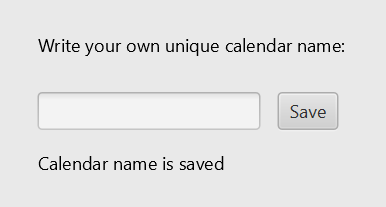

#### Beskrivelse av appen

Appen skal bestå av en personlig timeplan for fast ukebasis. Her skal en bruker kunne opprette en timeplan og fylle den med innhold fra forhåndsbestemt opplegg, som faste yogatimer med et treningsstudio, eller egenbestemt opplegg, som ukentlige møter med familien. Appen skal så vise timeplanen på en oversiktlig måte ved hjelp av en tabellbasert grafisk visning.

Bruker oppretter enkelt en timeplan med et unikt kalendarnavn i appen, og denne lagres så på server. Dermed kan bruker enkelt hente opp igjen timeplanen sin på andre enheter ved hjelp av det unike kalendernavnet som timeplanen ble generert under. Brukeren kan når som helst endre på innholdet i sin timeplan. 

Timeplanen er i utgangspunktet ikke ment som en kalender med arrangementer som endres for hver uke i løpet av året. Bruksområdet er i større grad rettet mot faste planer som repeteres hver uke over en viss periode, for eksempel over en sommer, et semester eller et år.

**Eksempelbilder for å gjøre det lettere å se for seg funksjonaliteten til den ferdige applikasjonen**:

#### Brukerhistorier

**Brukerhistorie for første release**: Jarl åpner KalenderAppen, skriver inn navnet på kalenderen sin og lagrer kalenderen (slik at den kan nås ved en senere anledning). Appen sjekker om kalendernavnet er unikt, og gir tilbakemelding om dette.

**Utfyllende brukerhistorie**: Jarl er en ny student på NTNU, som ønsker å bli mer strukturert. Selv om Jarl som student har variasjoner i timeplanen sin ønsker han først og fremst en oversikt over de faste aktivitetene sine. Han tar derfor i bruk MinKalender. Der kan han velge sine emner, samt legge til andre faste egne aktiviteter. For å finne igjen kalenderen sin, aksessere den fra flere enheter og gjøre forandringer gir Jarl kalenderen et uniktnavn.

#### Ferdig applikasjon
Den ferdige løsningen vil la 
