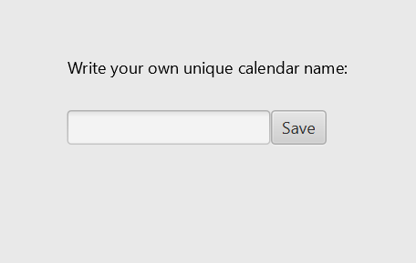
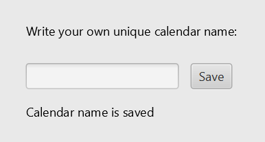

#### User stories 

**First release user story**: Jarl opens the Calendar App, enters the name of his calendar and saves the calendar (so that it can be accessed at a later time). The app checks whether the calendar name is unique and gives feedback about this.

**Second release user story**:
1. As a user I want to be able to load previous saved calendars by calendar names. 
2. As a user I want to create new calendars by giving them unique names

Calendars will not be shown in GUI at this point

**Third release user story**:
1. A user can create new calendars by giving them unique names
2. By opening a calendar a user are able to delete it 
3. A user can access previous seved calendars by giving the application a valid calendar name. The calendar accessed calendar is shown in a GUI.
4. A user can click on an appointment in the GUI to see all appointment details
5. A user can select and delete the selected appointment in a calendar. The appointment is immediately removed from the GUI.
6. When an appointment is selected a user can change details of the appointment. Changes can be made on all appointment details. Changes are saved to the current calendar. There should not be possible to make changes in an apointment if the change make appointment colide with another existing appointment.

 
