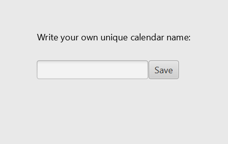
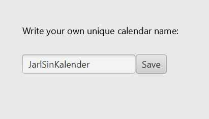

#### User stories 

**First release user story**: Jarl opens the Calendar App, enters the name of his calendar and saves the calendar (so that it can be accessed at a later time). The app checks whether the calendar name is unique and gives feedback about this.

**Descriptive user story**: Jarl is a new student at NTNU, and he wants to become more structured in his daily scheduling. Although Jarl, as a student, has some variations in his timetable, he primarily wants an overview of his regular activities. He therefore uses MinKalender. There, he can choose his subjects, as well as add other fixed activities of his own. In order to retrieve his calendar at a later time, access it from several devices and make changes, Jarl gives the calendar a unique name.
