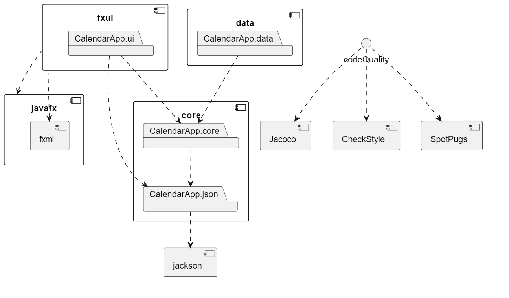
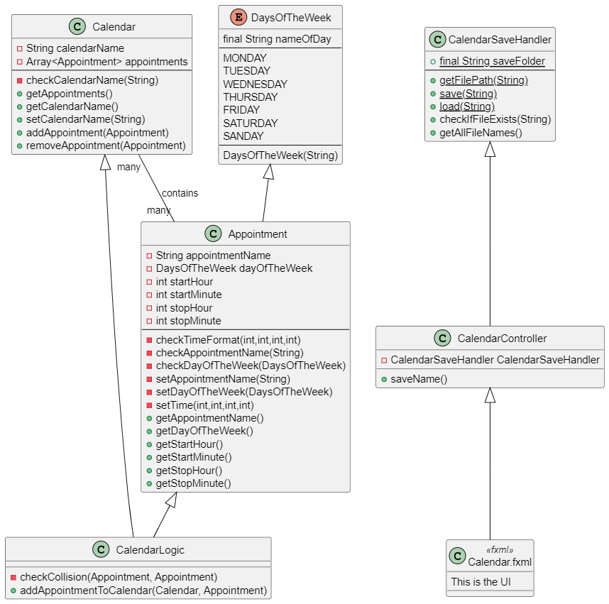

# Group gr2230 repository 
 

## Welcome to our calendar app for personal schedules!

This project uses maven for building and running.

To run, cd into the *2230* folder, and use the appripriate compile and run commands. First, prepare Maven through the command "mvn clean install", and thereafter, run the project with "mvn javafx:run -pl fxui".

If you want to quality check the project, this will be done through the command "mvn verify", still in the *2230* folder. This will make a report in the terminal, showcasing any CheckStyle and SpotBugs remarks.

##### User stories
To see a list of relevant user stories for this project see [here](2230/userStories.md).

##### Project description 
To see a full description of the project and its functionality, look at [this](2230/README.md) readme file.

### Modularization

This project consists of a full three layer modularization, divided into the folders *core*, *data* and *fxui*.

The domain layer (main logic classes) for the project will be kept in the *core* folder, while the user interface layer (ui and controller classes) will be kept in the *fxui* folder. 
The *data* folder will act as our server in this release, and will store the data for calendars and appointments.

### File overview

In the *2230* folder you will find the *core*, *data* and *fxui* folders, *docs* folder for documentation and **puml** source code, and the parent **pom** file for this project. You will also find the second **README** file, containing a desciption of the project, and the **userStories** file. 

Each of the *core*, *data* and *fxui* folders contains a *src* folder and a child **pom** file. The *main* and *test* folders lies within each of the *src* folders, and the **test** classes for each of the modules will be kept within the *test* folders. The *main* folder contains the main classes and data for each of the modules, alongside the specific **module-info** file.

Within the *main* folder of *fxui*, you will find the fxui- *calendarApp* folder. This folder, in turn, holds the ui folder with **CalendarApp** and **CalendarController** files. You will also find a *resources* folder, in which the **Calendar**.fxml file resides. 

Within the *main* folder of *core*, you will find the core- *calendarApp* folder. This folder, in turn, holds the core folder with main logic files for the project, and a *json* folder for the **CalendarSaveHandler** file, and the files for serialization and deserialization. 

Within the *main* folder of *data*, you will find the *savedCalendars* folder. This folder will hold all the saved calendars for the project. 

### File overview in list format

- 2230
    - pom.xml
    - [README.md](2230/README.md)
    - [userStories.md](2230/userStories.md)
    - [**core**](2230/core)
        - pom.xml
        - src
            - [main/java](2230/core/src/main/java)
                - module-info.java
                - calendarApp
                    - core
                        - Appointment.java
                        - Calendar.java
                        - CalendarLogic.java
                        - DaysOfTheWeek.java
                    - json
                        - AppointmentDeserializer.java
                        - AppointmentSerializer.java
                        - CalendarAppModule.java
                        - CalendarAppPersistence.java
                        - CalendarDeserializer.java
                        - CalendarSerializer.java
                        - CalendarSaveHandler.java
            - [test/java/CalendarApp](2230/core/src/test/java/calendarApp)
                - tests for the classes in main
    - [**data**](2230/data)
        - pom.xml
        - [src/main/java](2230/data/src/main/java)
            - module-info.java
            - CalendarApp/data/savedCalendars
                - a number of saved calendars (.json)
    - [**fxui**](2230/fxui)
        - pom.xml
        - src
            - [main](2230/fxui/src/main)
                - java
                    - module-info.java
                    - calendarApp/ui
                        - CalendarApp.java
                        - CalendarController.java
                - resources/CalendarApp/ui
                    - Calendar.fxml
            - [test/java/calendarApp/ui](2230/fxui/src/test/java/calendarApp/ui)
                - tests for the classes in main
    - [**docs**](2230/docs)
        - release1.md
        - release2.md
        - images 
            - images for the root level README file (.png)
            - images for project level README and userStories (.png)
        - architecture.puml
        - classDiagram.puml

> Every individual file is marked with the appropriate filename extension, everything else in the list is to be considered as folders

### Architecture

##### Class diagram

> Click here to see the source code for the [class diagram](2230/docs/classDiagram.puml) or [architecture diagram](2230/docs/architecture).

